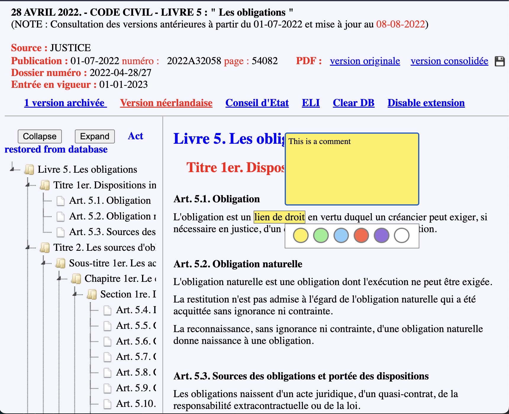
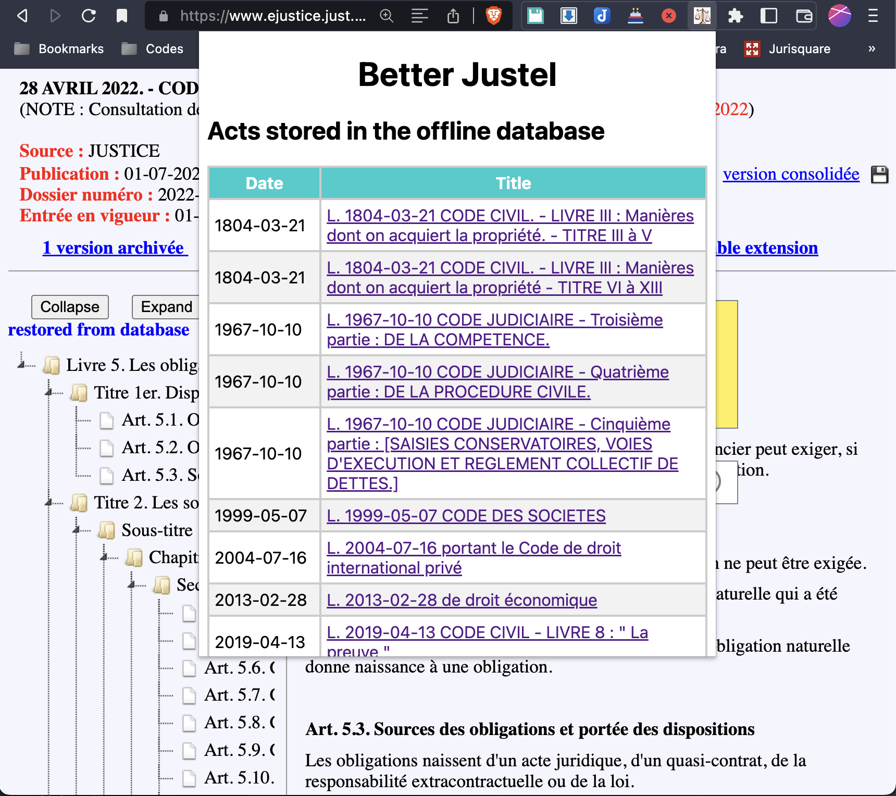

# Better Juportal

## Concept

This browser extension (available for [Chrome](https://chrome.google.com/webstore/detail/better-justel/jjknlnihcjeefjgdacaanbiedamibimp) and [Firefox](https://addons.mozilla.org/fr/firefox/addon/better-justel/)) takes the information publicly available on [Justel](https://www.ejustice.just.fgov.be/loi/loi.htm), the Belgian database of consolidated legislation, and displays it in a more user-friendly experience.

IMPORTANCE NOTICE: If you are using the Firefox extension, the first time you will surf to Justel website, a blue dot will appear on the icon of the extension. You must right-click on the extension icon and grant it permission to always run on www.ejustice.fgov.be. Otherwise, the extension will not work.

## Features

- The page on which each act is displayed is divided in three panes : the upper pane containing general information on the act; the left pane with a table of content; and the right pane displaying the content of the act. Each pane can be resized by hovering the mouse on the dividing line and dragging it.
- In the info pane, the icon of a disk allows to download and automatically name the consolidated version of the act in PDF. The link "Clear database" removes the act from the offline database. The link "Disable extension" shows the original text of the act, without the extension.
- The left pane displays the internal structure of the acte based on its headings (Title, Chapter, Section, etc.) and allows to jump immediately to the relevant part of the act by clicking on an article. The table of content can be fully collapsed or expanded with two different buttons.
- In the right pane, the hierarchical level of each heading is reflected by appropriate styling. The content of each article is also analysed. The text is indented to make appear more clearly the internal structure (§, 1°, a), hyphen, etc.). The number of each article is shown in bold. Subparagraphs (alénas) are also automatically numbered in the margin of the article.
- When text is selected within an article in the right page, a popup window appears and allows to highlight the text (in yellow, green, blue or red) or to underline it (in violet). To edit an existing highlight, click on it : the color of it can be changed by clicking on another color, or deleted by clicking on the white circle. A comment can also be inserted. The popup window can be closed by clicking elsewhere in the right pane. When a comment is added to highlighted text, this text is displayed in italic.
- Highlights are stored in the local storage of the browser and are restored the next time the same act is displayed. Saved highlights can be managed with the commands available in the popup window shown when clicking on the icon of the extension. They can be exported in JSON format and imported again by pasting the content of the JSON file in the relevant input box. A daily backup to Dropbox can also be set up (access is limited to the app folder in Dropbox, no access to the rest of the Dropbox is granted).
- Acts displayed are automatically stored in the browser local storage. When visited again, the act loads much quicker (which is useful for very long texts such as the Code of Economic Law), unless it has been updated in the online database in the meanwhile. Stored acts can also be consulted offline: when no internet access is available, a user browsing to the ELI URL of a stored act will automatically be redirected to the offline version of it. The online or offline character of the text displayed is mentioned on top of the left pane. The list of stored acts can also be consulted by clicking on the icon of the extension (they are listed in chronological order). Highlights are also displayed and are editable when in offline mode.

## Known bugs and limitations

- For the time being, the extension only works with the French version of Justel, to the exclusion of the Dutch version.
- The HTML of some acts available on Justel is faulty and cannot therefore be displayed correctly.
- This extension is still under development and may therefore still contain bugs or errors. Do not rely on it and always double-check the content of an act in official sources.
- Do not hesitate to report any problem or suggested improvement, and/or to contribute to the source code.

## Credits

This extension was written by Rafaël Jafferali. This program is free software: you can redistribute it and/or modify it under the terms of the GNU General Public License as published by the Free Software Foundation, either version 3 of the License, or (at your option) any later version.

This program is distributed in the hope that it will be useful, but WITHOUT ANY WARRANTY; without even the implied warranty of MERCHANTABILITY or FITNESS FOR A PARTICULAR PURPOSE. See the GNU General Public License for more details.

You should have received a copy of the GNU General Public License along with this program. If not, see <https://www.gnu.org/licenses/>.

This extension was inspired by the very thorough userscript written by Naja Melan <https://userscripts-mirror.org/scripts/show/11725>.

It makes use of the following open source libraries :

- dom-anchor-text-position 5.0.0 &lt;https://www.npmjs.com/package/dom-anchor-text-position&gt; and dom-anchor-text-quote 4.0.2 &lt;https://www.npmjs.com/package/dom-anchor-text-quote&gt;, packaged by judell &lt;https://github.com/judell/TextQuoteAndPosition&gt;
- download.js 4.2 &lt;https://github.com/rndme/download&gt;
- Dropbox SDK &lt;https://github.com/dropbox/dropbox-sdk-js&gt;
- jquery 3.6.1 &lt;https://jquery.com/&gt;
- jquery resizable plugin 0.35 &lt;https://github.com/RickStrahl/jquery-resizable&gt;
- jsTree 3.3.12 &lt;https://www.jstree.com/&gt;

## Release history
- Version 0.1.2022.1116 : first version published online.
- Version 0.1.2022.1204 : added auto-numbering of subparagraphs (alinéas).
- Version 0.1.2023.0506 : added autofocus to search input box in popup window
- Version 0.1.2023.0507 : clear button in popup window also deletes highlights; confirmation added before clearing; change toggle Dropbox to enable/disable Dropbox; added overflow to annotations
- Version 0.1.2023.0513 : added compatibility to Firefox
- Version 0.1.2023.0514 : visibility of subparagraphs (alinéas) numbering only visible when hovering with the mouse over the relevant article; display in the toc the number of last article even though it is not properly encoded in the HTML
- Version 0.1.2023.0530 : improves indent of articles (includes numbering starting with I., II., etc.)
- Version 0.1.2023.0601 : improves indent of articles (includes numbering starting with i., ii., etc.)
- Version 0.1.2023.0722 : for some (as yet) unidentified reason, in the Code of Economic Law, some highlights were sometimes saved under an inexistent article, resulting in a bug when trying to restore the highlights for such statute. A work-around has now been found.
- Version 0.1.2023.0909 : URLs inserted in an annotation will be converted to hyperlinks when the annotation is reopened
